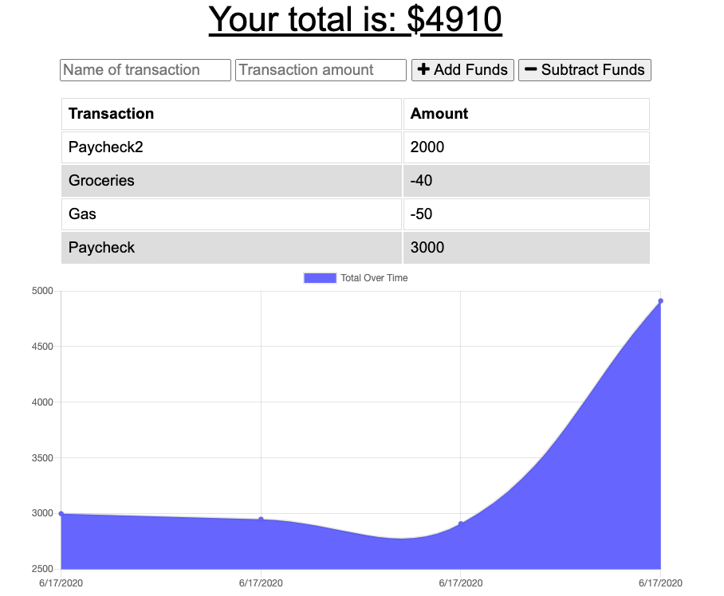

# Budget-Tracker

## Description

This is a budget-tracker application. Users can keep track of their budget by adding deposits and subtracting expenses. This app can be downloaded via desktop or mobile and be used offline. This application was created using MongoDB, Mongoose, Node, Express, Javascript, Jquery, HTML, CSS, PWA, and IndexedDB.

## Table of Contents

* [Description](#description)
* [User Story](#user-story)
* [Installation](#installation)
* [Usage](#usage)
* [License](#license)
* [Contributing](#contributing)
* [Tests](#tests)
* [Questions](#questions)
* [Deployed Application URL](#deployed-application-URL)

## User Story

AS AN avid traveller
I WANT to be able to track my withdrawals and deposits with or without a data/internet connection
SO THAT my account balance is accurate when I am traveling

## Installation

No installation needed

## Usage

The deployed application link will take you to the homepage. Here, you can type in the name of the transaction and add or subtract funds from the total funds. A graph will render showing your transactions overtime.

## License

## Contributing

Please follow standard contributing guidelines.

## Tests

No tests to run.

## Questions

For any questions, please contact kendayao at kendayao@gmail.com

## Deployed Application URL

Deployed application link: https://tranquil-oasis-41593.herokuapp.com/

